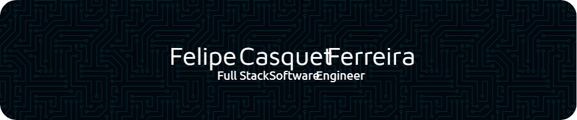

<h3 align="left">Sempre busquei conhecer a razão de um fato através de questionamentos que permitam utilizar a lógica  para desvendar problemas e encontrar soluções. Foi assim que encontrei-me no universo do desenvolvimento, inovação e empreendedorismo. Atualmente estou no quarto semestre do curso de Engenharia de Software na  Faculdade de Informática e Administração Paulista (Fiap) em São Paulo.</h3>

###

<h1 align="left">Conhecimentos e habilidades técnicas</h1>

###

<h2 align="center">Front-End Development</h2>

###

###

  
  
  
  
  
  
  
  
  
  
  
  
  

###

  

###

<h2 align="center">Back-End Development</h2>

###

###

  
  
  

###

  
  
  
  
  

###

  
  
  

###

<h2 align="center">Data Science</h2>

###

  
  
  
  
  
  
  

###

<h2 align="center">Arduino & IoT</h2>

###

  
  
  

###

<h2 align="center">Software Methodology Development</h2>

###

  

###

<h4 align="center">Contato</h4>

###

  

###

  
  
  
  

###
